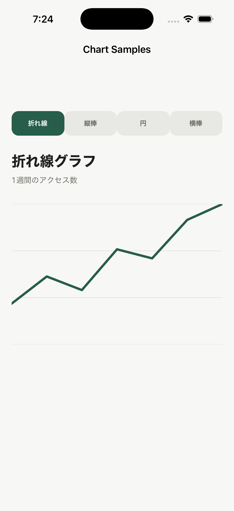
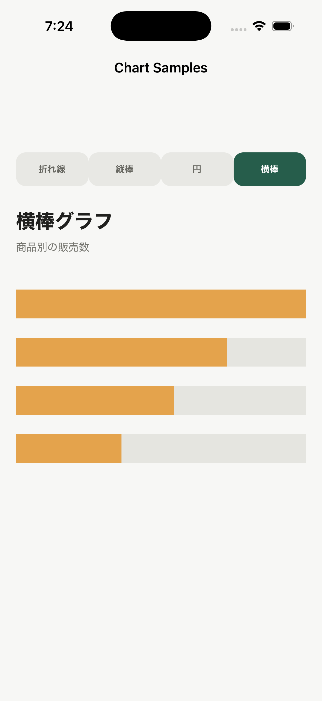
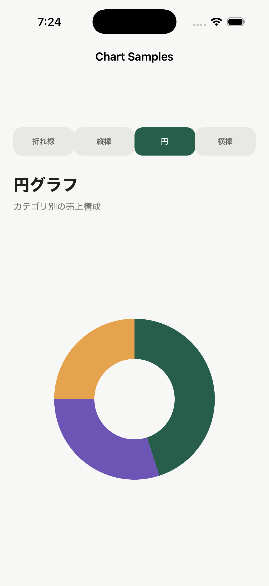
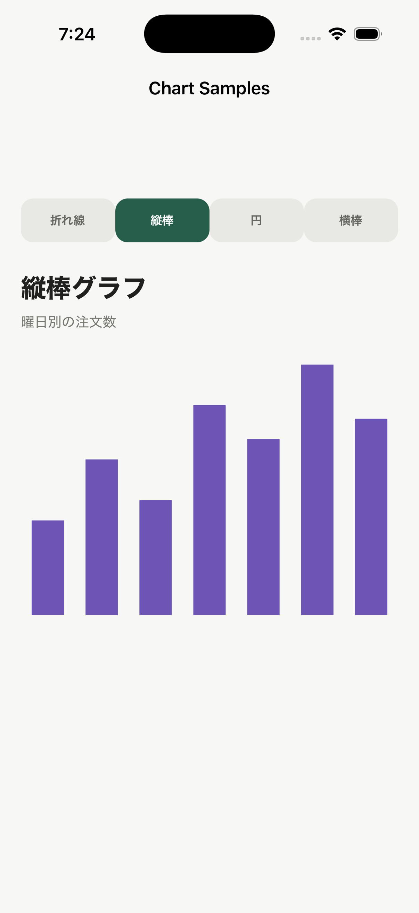

# DartNative Chart Samples

DartNative でグラフを自作するサンプルアプリです。DartNative 向けのチャートライブラリを使用せず、`CustomPaint`、`CustomPainter`、`Canvas` を組み合わせて描画しています。

サンプルは折れ線、縦棒、円、横棒の4種類です。画面上部のボタンから、グラフごとのページを切り替えられます。

## Screenshots

| 折れ線グラフ | 縦棒グラフ |
| --- | --- |
|  |  |

| 円グラフ | 横棒グラフ |
| --- | --- |
|  |  |

## サンプルの構成

```text
lib/
├── main.dart
└── chart/
    ├── line_chart_page.dart
    ├── vertical_bar_chart_page.dart
    ├── pie_chart_page.dart
    └── horizontal_bar_chart_page.dart
```

`main.dart` はアプリの起動とページ切り替えを担当します。各ファイルには、表示用のページと描画を担当する `CustomPainter` が含まれています。

## グラフを自作する基本形

はじめに `CustomPaint` へ表示サイズと Painter を渡します。

```dart
CustomPaint(
  size: const Size(320, 240),
  painter: const LineChartPainter([18, 30, 24, 42, 38]),
)
```

Painter の `paint` メソッドで、値を描画領域内の座標へ変換します。折れ線グラフでは点を `Path` でつなぎ、`Canvas.drawPath` で描画します。

```dart
final maximum = values.reduce((a, b) => a > b ? a : b);
final path = Path();

for (var index = 0; index < values.length; index++) {
  final x = size.width * index / (values.length - 1);
  final y = size.height - values[index] / maximum * size.height;
  index == 0 ? path.moveTo(x, y) : path.lineTo(x, y);
}

canvas.drawPath(path, Paint(
  color: const Color(0xFF265D4B),
  style: PaintingStyle.stroke,
  strokeWidth: 4,
));
```

ほかのグラフも同じ考え方です。

- 縦棒グラフ: 値を高さへ変換し、`Canvas.drawRect` で描画
- 円グラフ: 値の割合を角度へ変換し、`Canvas.drawArc` で描画
- 横棒グラフ: 値を幅へ変換し、背景と前景の矩形を描画

色、余白、線幅は `Paint`、データは各 Painter に渡している `List<double>` を変更すると調整できます。データが変化するグラフでは、`shouldRepaint` で新旧データを比較して再描画してください。

## 実行方法

DartNative の依存関係、実行、解析には必ず `dn` を使用します。

```sh
dn pub get
dn analyze
dn run -d <device-id>
```

実行には DartNative のライセンス設定が必要です。

```sh
dn config --license-key dnk_...
```

ライセンスキーはリポジトリへコミットしないでください。
