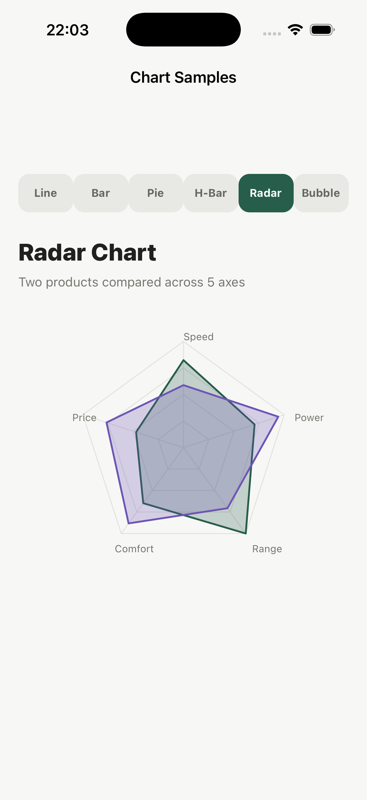
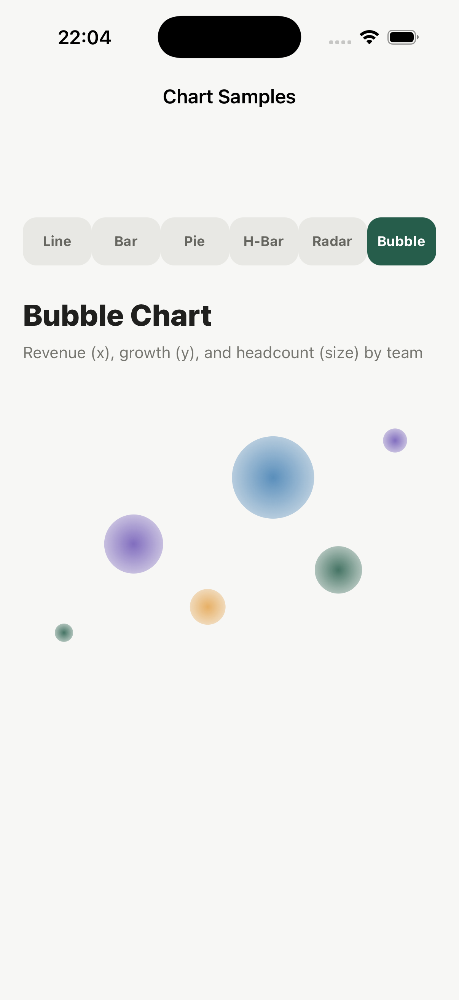

# chart_kit

Reusable **line**, **vertical bar**, **pie**, **horizontal bar**, **radar**,
and **bubble** chart painters for [DartNative](https://dartnative.com) apps —
built entirely with `CustomPaint`/`CustomPainter`/`Canvas`, no third-party
chart package required.

Each painter takes plain data (a `List<double>`, or a small typed value
object for radar/bubble), so it drops into any `CustomPaint` you already
have — feed it real data from your own API, or mock data while you build.
The line, vertical bar, horizontal bar, and pie painters also support
optional gradient fills and a translucent "glass" background panel.

## Screenshots

| Line | Vertical bar |
| --- | --- |
|  |  |

| Pie | Horizontal bar |
| --- | --- |
|  |  |

| Radar | Bubble |
| --- | --- |
|  |  |

## Install

Add a dependency on `chart_kit` in your app's `pubspec.yaml`. Once published
to [dartpub.dev](https://dartpub.dev), a plain version dependency resolves it
the same way the DartNative framework itself does:

```yaml
dependencies:
  chart_kit: ^0.2.0
```

Then fetch it with:

```sh
dn pub get
```

## Usage

```dart
import 'package:chart_kit/chart_kit.dart';

CustomPaint(
  size: const Size(320, 240),
  painter: const LineChartPainter([18, 30, 24, 42, 38]),
)
```

The other painters take the same shape of input:

```dart
CustomPaint(painter: const VerticalBarChartPainter([28, 46, 34, 62]));
CustomPaint(painter: const PieChartPainter([45, 30, 25]));
CustomPaint(painter: const HorizontalBarChartPainter([88, 64, 48, 32]));

CustomPaint(
  painter: RadarChartPainter(
    const ['Speed', 'Power', 'Range', 'Comfort', 'Price'],
    const [
      RadarSeries(label: 'Model A', color: Color(0xFF265D4B), values: [70, 60, 85, 55, 40]),
      RadarSeries(label: 'Model B', color: Color(0xFF6C55B5), values: [50, 80, 60, 75, 65]),
    ],
  ),
);

CustomPaint(
  painter: const BubbleChartPainter([
    BubblePoint(x: 12, y: 18, size: 8),
    BubblePoint(x: 60, y: 60, size: 30),
  ]),
);
```

### Gradient fills and glass backgrounds

`LineChartPainter`, `VerticalBarChartPainter`, `HorizontalBarChartPainter`,
and `PieChartPainter` all accept an optional `backgroundColor` — typically a
translucent color — that draws a rounded "glass" panel behind the chart:

```dart
LineChartPainter(values, backgroundColor: const Color(0x14000000));
```

`LineChartPainter` additionally accepts `areaGradientColors` (2+ colors, top
to bottom) to fill the area under the line, and
`VerticalBarChartPainter`/`HorizontalBarChartPainter` accept
`barGradientColors` (2+ colors, along the bar's length) to fill each bar with
a gradient instead of a flat color:

```dart
LineChartPainter(
  values,
  areaGradientColors: [Color(0x662CA57B), Color(0x002CA57B)],
);
VerticalBarChartPainter(
  values,
  barGradientColors: [Color(0xFF6C55B5), Color(0xFFB59CF6)],
);
```

Gradient fills use a linear shader; gradient **strokes** aren't supported by
the underlying framework, so line strokes stay solid.

## Public API

- `LineChartPainter(List<double> values, {Color? backgroundColor, List<Color>? areaGradientColors})`
  — connects values left to right with a light horizontal grid behind it.
- `VerticalBarChartPainter(List<double> values, {Color? backgroundColor, List<Color>? barGradientColors})`
  — one bar per value, height normalized against the largest value.
- `PieChartPainter(List<double> values, {Color? backgroundColor})` —
  donut-style pie chart, each value rendered as a proportional arc slice.
- `HorizontalBarChartPainter(List<double> values, {Color? backgroundColor, List<Color>? barGradientColors})`
  — one bar per value against a track background, width normalized against
  the largest value.
- `RadarChartPainter(List<String> axisLabels, List<RadarSeries> series, {double fillOpacity = 0.25})`
  — one overlaid, translucent-filled polygon per series, for comparing
  multiple items across shared axes. Needs 3+ axes; every series needs one
  value per axis.
- `BubbleChartPainter(List<BubblePoint> points, {double minRadius = 8, double maxRadius = 36})`
  — one radial-gradient circle per point, positioned by `x`/`y` and sized by
  `size`.
- `RadarSeries({required String label, required Color color, required List<double> values})`
  — one polygon on a `RadarChartPainter`.
- `BubblePoint({required double x, required double y, required double size})`
  — one circle on a `BubbleChartPainter`.

Colors, spacing, and stroke width are otherwise fixed in each painter — data
(and the optional styling above) is what you pass in. If a chart's data
changes over time, wrap it in a `StatefulWidget` and rebuild with a new
painter instance.

## Example

See [`example/`](example) for a full showcase app that switches between all
six charts. Run it with:

```sh
cd example
dn pub get
dn run
```

## License

MIT — see [LICENSE](LICENSE).
